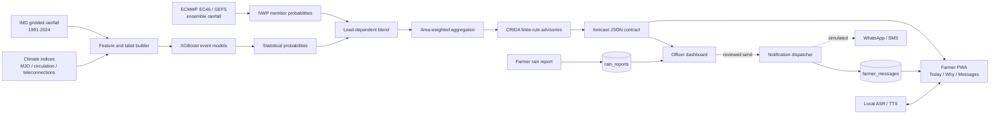
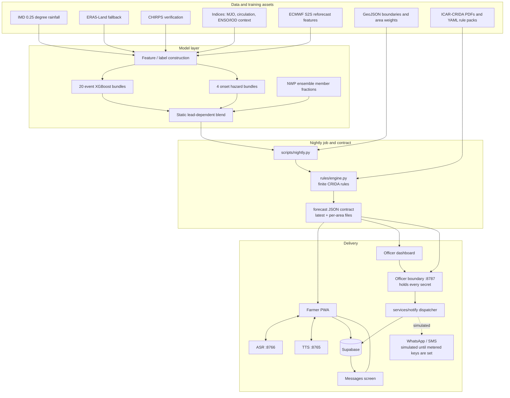

# VarshaDrishti

VarshaDrishti is an SIH monsoon decision-support prototype for Karnataka farmers. It converts gridded historical rainfall, current observations, extended-range ensemble forecasts, circulation/MJO predictors, and ICAR-CRIDA agronomic rules into localized probabilities and plain-language actions.

The repository implements an offline-first demonstration: a nightly forecast job writes a versioned JSON contract, a React/Vite PWA reads that contract at hobli/block/district level, and optional local ASR/TTS and officer notification services add voice and messaging workflows.

> **Scope.** This README describes the code actually present in this repository — every number, metric, and provenance string below is produced by the shipped pipeline and reproducible from a clean checkout. The deployed footprint is a Karnataka pilot of 1,127 named areas; [Scaling the architecture to India](#scaling-the-architecture-to-india) sets out the national path the data contract, area codes, and rule format were designed for from the start.

## SIH problem and proposed solution

Farmers need an answer to practical questions such as “should I sow now?” rather than a raw rainfall map. The SIH problem addressed here is extended-range monsoon decision support at local administrative scales, including onset uncertainty, false onset, dry spells, and heavy-rain risk.

The solution is to:

1. Build cell-day training examples from IMD rainfall for Karnataka.
2. Train probabilistic XGBoost event models for 7, 14, 21, and 28-day horizons.
3. Add ECMWF S2S rainfall where validated, plus circulation and MJO predictors.
4. Blend statistical probabilities with EC46/GEFS ensemble-member probabilities.
5. Aggregate grid cells to hoblis, blocks, and districts using stored area weights.
6. Apply finite, auditable CRIDA rule packs to produce localized actions.
7. Deliver the result as a small JSON contract for an offline-capable farmer PWA, with Kannada/Hindi/Telugu/English voice and an officer-to-farmer notification path.

## Key features

**Forecasting**

- Probabilistic models for five events — onset, false onset, 7-day dry spell, 14-day dry spell, and heavy rain — at four weekly leads (`w1`-`w4`).
- Statistical XGBoost probabilities blended with EC46/GEFS ensemble-member probabilities using lead-specific, measured weights.
- Area-weighted aggregation from IMD 0.25 deg cells to 1,127 named panchayat/hobli, block, and district areas.
- Published skill per event and lead (Brier skill score, ROC AUC, reliability bins), a machine-readable `no_skill_slots` list, and an `advisory_horizon_weeks` cap that both the farmer UI and the broadcast path enforce.
- Full provenance on every bulletin: NWP source and member count, training window, excluded features, blend weights, calibration status, and live feature coverage.

**Advisory**

- 125 ICAR-CRIDA rules across six district packs plus a statewide fallback, every one citing a real contingency-plan table.
- Finite, auditable YAML rules with no LLM anywhere in the decision path; conditions are parsed, never evaluated as code.
- Crop growth stage derived from measured onset delay, so advice tracks the season instead of assuming pre-sowing.
- Confidence wording scaled to the matched probability, in both languages.

**Farmer PWA**

- Onboarding by language, hobli, crop, and optional phone number, with in-app language switching afterwards.
- Today, Why, and Rain Report screens in Kannada, Hindi, Telugu, and English.
- Traditional Kannada *karte* rain-calendar naming alongside calendar dates.
- Offline-first: service-worker caching of the app shell, forecast, geography, and photographs.
- Offline rain-report outbox that flushes to Supabase on reconnect.
- A notification screen in WhatsApp-style message bubbles, reached from a bell on Today that carries an unread dot.
- A read-aloud button on every farmer screen, speaking that screen's key detail in the chosen language via local Indic Parler-TTS.

**Officer operations**

- Hazard choropleth across all 1,127 areas with farmer rain reports plotted as ground truth.
- Ranked table of the areas that need a message today, with live subscriber counts.
- Reviewable broadcast: a real Kannada preview and an explicit passcode before anything is sent.
- Advisories delivered straight to the farmer's in-app notification page, with duplicate suppression and a recorded dispatch history.
- Forecast verification and 2024 replay/hindcast screens for explaining model behaviour.

## End-to-end workflow



### Forecast generation

`scripts/nightly.py` is the operational assembly point. It loads area-weight matrices, obtains recent observations from the Open-Meteo forecast API or cache, derives live features, loads the frozen inference table, runs XGBoost, optionally loads EC46 and GEFS caches, blends the probabilities, aggregates them to named areas, evaluates CRIDA rules, and emits the contract files.

The nightly GitHub Actions job runs at `20:00 UTC` (`01:30 IST`), fetches indices and NWP data, runs the pipeline, validates the P6 contract, and commits changed forecast/cache files. It is configured in `.github/workflows/nightly.yml`.

## System architecture



The officer boundary is the only process holding a secret. The browser never sees the
Supabase service key or a provider token — it holds a shared passcode, and the farmer's
copy of an advisory arrives through `farmer_messages`, which carries no personal data.

## Machine-learning report

### Data sources and inputs

| Input | Repository implementation | Role |
|---|---|---|
| IMD gridded rainfall | `src/varshadrishti/data/rainfall.py`, `scripts/download_imd.py` | Primary historical truth; 0.25° grid, 1991–2024, Karnataka cells |
| ERA5-Land | rainfall loader fallback | Fallback data path; not the primary trained truth |
| CHIRPS | `scripts/download_chirps.py` | 0.05° rainfall for panchayat-scale verification/analysis |
| ECMWF EC46 | `scripts/fetch_nwp.py`, `data/cache/ec46` | 46-day ensemble rainfall at inference time |
| NOAA GEFS | `scripts/fetch_nwp.py`, `data/cache/gefs` | 35-day ensemble rainfall and proxy used for blend evidence/weights |
| Open-Meteo observations | `src/varshadrishti/pipeline/observations.py` | Recent rainfall for live features; cached for replay |
| MJO/RMM and circulation indices | `data/raw/indices*`, `src/varshadrishti/features/indices.py`, `extended.py` | Intraseasonal/large-scale predictors |
| ENSO/IOD/teleconnection indices | `oni`, `dmi`, `nino34_anom` and provenance output | Ingested and reported as context; excluded from shipped statistical features after documented ablations |
| CRIDA documents | `data/crida/*.pdf`, `src/varshadrishti/rules` | Source material and rule-backed crop actions |

The nested `varsha-drishti-model/` package contains the training-side implementation and raw model-development assets. The root application keeps the serving contract and trained bundles under `models/xgb/`.

### Labels and targets

The definitions are in `src/varshadrishti/features/labels.py`:

- rainy day: at least 2.5 mm;
- onset: a 5-day wet window with at least 3 rainy days, subject to the 20–40 mm onset threshold and season bounds;
- false onset: an onset-like spell followed by a 10-day dry break, checked within the documented 30-day window;
- 7-day dry spell and 14-day dry spell/break;
- heavy rain: at least 64.5 mm;
- season: June 1 through September 30, with onset confirmation and cutoff rules encoded in the label module.

The contract trains five event families at four cumulative horizons: `onset`, `false_onset`, `dry7`, `dry14`, and `heavy` × 7/14/21/28 days = 20 binary classifiers. Four additional discrete-time onset hazard models estimate onset in weeks 1–4 and are chained into a survival curve.

### Preprocessing and feature engineering

The feature builder uses causal rainfall history and seasonal context. The documented windows are 1, 3, 7, 14, and 30 days, with wet-day counts, days since rain, wet-spell state, days since a wet spell, spell deficit, regional rain/dry context, and cell-versus-region rainfall. It adds seasonal day-of-year, cell climatology, onset anomaly, RMM/MJO variables, and (for the extended training path) circulation anomalies/trends and valid-time MJO phase features.

ECMWF features are ensemble mean and spread for 7, 14, 21, and 28 days. They are sparse because they come from real ECMWF cycle/hindcast dates; missing values are supported by XGBoost’s native missing-value path. At live inference, `feature_coverage` records known gaps, including the documented ECMWF reforecast coverage ending in 2023 and circulation-index coverage ending in 2024.

The model code excludes identifiers and `oni`, `dmi`, and `nino34_anom` from predictor columns. Repository comments record why: paired tests and ENSO-conditioned/shuffled comparisons did not demonstrate robust generalization with only 34 independent seasons. These signals remain in provenance/context rather than being silently claimed as predictive features.

### Training, validation, and test strategy

The split is chronological by monsoon year, so an entire season stays in one partition:

| Split | Years |
|---|---:|
| Train | 1991–2015 |
| Validation | 2016–2019 |
| Test | 2020–2024 |

The nested training package implements the split, model fitting, validation threshold selection, and bundle persistence. The shipped metadata reports row counts per model; the documented panel is 323 cells × 34 seasons × seasonal days, approximately 1.34 million cell-day rows before target-specific missing-label filtering.

### Models and configuration

- Event models: XGBoost `XGBClassifier`, `binary:logistic`, log-loss evaluation, histogram tree method, deterministic `random_state=42`, early stopping, and no class reweighting by default so probability quality is not distorted.
- The base configuration is in `varsha-drishti-model/src/varshadrishti/config.py`. Shipped bundles contain per-target tuned hyperparameters in `metadata.json`; exact learning rate/tree count can therefore differ by target.
- Decision thresholds are selected on validation to maximize F1. Probabilities are emitted as raw binary-logistic probabilities; forecast provenance says there is no isotonic/out-of-fold calibration map.
- NWP event probabilities are member fractions with Laplace adjustment. `src/varshadrishti/pipeline/blend.py` applies current lead weights `w1=0.32`, `w2=0.09`, `w3=0.01`, `w4=0.06`, plus the implemented sharpening/recalibration transform.

### Held-out results in the shipped event bundles

The following are ROC-AUC and Brier Skill Score from `models/xgb/events/**/metrics.json` for test years 2020–2024. BSS is relative to the train-period climatology reference; values above zero beat that reference.

| Event | 7 days | 14 days | 21 days | 28 days |
|---|---:|---:|---:|---:|
| Onset ROC-AUC / BSS | 0.872 / 0.441 | 0.826 / 0.294 | 0.788 / 0.183 | 0.758 / 0.113 |
| False onset ROC-AUC / BSS | 0.746 / 0.140 | 0.690 / 0.096 | 0.677 / 0.099 | 0.691 / 0.119 |
| 7-day dry ROC-AUC / BSS | 0.739 / 0.148 | 0.746 / 0.175 | 0.752 / 0.198 | 0.765 / 0.234 |
| 14-day dry ROC-AUC / BSS | 0.757 / 0.079 | 0.693 / 0.030 | 0.666 / 0.031 | 0.683 / 0.072 |
| Heavy rain ROC-AUC / BSS | 0.879 / 0.349 | 0.845 / 0.347 | 0.819 / 0.344 | 0.791 / 0.322 |

The onset hazard documentation reports approximately 0.78 AUC for week 1 and approximately 0.55 for week 4. Week 4 should be treated as low confidence.

### Experiments, ablations, and selection rationale

- ECMWF S2S features were retained for cumulative onset models and onset-hazard weeks 1–3 after documented ablation showed positive BSS deltas; they were not retained for false onset, dry7, dry14, heavy, or hazard week 4.
- ENSO/IOD fields were tested as direct predictors and conditioned climatology. The repository records negative or statistically inconclusive results, so they are context/provenance rather than model features.
- The 14-day dry/break target carries the lowest BSS of the shipped families. It is published with that score attached and its low-skill leads named in `no_skill_slots`, so the contract itself tells every consumer how far to trust it.
- NWP blend evidence was derived from GEFS reforecast/proxy experiments. The code distinguishes that evidence from the EC46 runtime source; current weights are not a fresh EC46-only calibration.
- XGBoost plus a conservative NWP blend was selected because it is lightweight at inference, versioned, auditable, and has positive held-out BSS for the principal event families. No claim is made that all event families are equally reliable.

The design principles behind those choices are chronological held-out testing, probability-oriented Brier/BSS reporting, explicit provenance on every bulletin, native missing-feature handling rather than imputed rainfall, finite auditable rules instead of an opaque generative recommendation layer, and offline reproducibility through cached inputs and versioned JSON artifacts.

### Validity envelope

The system publishes the bounds of its own skill rather than leaving a reader to infer them, and enforces those bounds in code:

- `skill.advisory_horizon_weeks` caps how far ahead the app is allowed to advise. The farmer UI stops issuing advice past it and the officer dashboard blocks broadcasting past it.
- `skill.no_skill_slots` names every event/lead combination that did not beat climatology, and travels inside every area file.
- `provenance.statistical.live_feature_coverage` reports the real gap on each run — ECMWF reforecast coverage ends in 2023 and circulation indices in 2024, so a live run records which features were populated.
- `provenance.calibration` states plainly that the boosters emit raw binary-logistic probabilities with validation-tuned thresholds and that the linear pool is not recalibrated.
- Blend weights are fixed per lead from the documented GEFS reforecast study, and `weight_provenance` says so on every bulletin, including that GEFS is a proxy for EC46.
- The training panel is 34 independent monsoon seasons over Karnataka; crop stage is a documented agronomic approximation from onset delay, at the same resolution as the CRIDA tables it feeds.

This is the same honesty the farmer-facing UI applies in words: a lead whose Brier skill score is at or below zero is labelled as no better than guessing, in the reader's own language.

## How weather becomes a farmer recommendation

1. `scripts/fetch_nwp.py` caches EC46 and/or GEFS precipitation ensembles for IMD cells covering the pilot. `pipeline/nwp.py` converts member trajectories to event probabilities.
2. `pipeline/observations.py` obtains recent rainfall from cache/Open-Meteo or IMD replay. `pipeline/infer.py` constructs current causal features and runs the 20 XGBoost bundles. Cumulative probabilities are converted to weekly lead risks where required by the runtime contract.
3. `pipeline/blend.py` combines statistical and NWP probabilities with lead-specific weights and records source diagnostics.
4. `pipeline/aggregate.py` applies stored IMD-to-area weight matrices to produce panchayat/hobli, block, and district values.
5. `rules/engine.py` loads YAML CRIDA packs, derives a coarse crop stage from onset delay, selects up to three actions, and writes English/Kannada text plus document/table references.
6. `contract.py` validates and writes `forecast/latest.json`, `forecast/index.json`, and per-area files. The browser reads these stable files; it does not run XGBoost.
7. `services/notify/dispatcher.py` reads those finished files, resolves the area's subscribers, asks the channel's provider to send, and records one notification row per farmer. It is strictly downstream: it never calls a model or a rule.

## Backend, frontend, database, and notifications

### Frontend

`web/` is a React 18 + Vite 5 PWA using React Router, MapLibre, and optional Supabase JS. `web/vite.config.js` serves root `forecast/` and `geo/` during development and copies them into `web/dist` during a build. `scripts/prebuild.mjs` runs `scripts/split_forecast.py` first.

Routes are `/`, `/today`, `/rain`, `/why`, `/messages`, `/officer`, `/replay`, and `/verify`. Farmer preferences are local. Forecast and geo assets use service-worker caching. Browser ASR/TTS helpers use `VITE_ASR_SERVER_URL` and `VITE_TTS_SERVER_URL`, falling back to `http://localhost:8766` and `http://localhost:8765`.

### Speech services

ASR (`services/asr/server.py`): `GET /health`, `POST /transcribe` with multipart field `audio` and `X-Lang: kn|hi|te`, and `POST /interpret` for repository keyword intent matching. ffmpeg converts audio to 16 kHz mono WAV. English is supported by interpretation vocabulary, not by the IndicConformer language mask.

TTS (`services/tts/server.py`): `GET /health` and `POST /synthesize` with `{ "text": "...", "lang": "kn|hi|te|en" }`, returning WAV. Indic Parler-TTS loads once at startup and uses separate spoken-text and voice-description tokenizers. First startup is slow because weights load; later requests reuse the process. Both run on the operator's own machine, so farmer audio never leaves it.

### Read-aloud

Every farmer screen has a ಕೇಳಿ (listen) button that speaks **the important detail of that
screen and nothing else** — a farmer who cannot read needs the decision, not the furniture:

| Screen | What it reads |
|---|---|
| Today | the verdict, how many of the last ten similar years saw the rain stop, and the CRIDA action |
| Why | the evidence behind that number, and how far ahead the forecast is trusted |
| Rain report | what is being asked, and why answering it matters |

`speak()` in `web/src/lib/speech.js` tries three sources in order: a pre-rendered clip,
then Indic Parler-TTS, then a same-language browser voice. It never substitutes an
unrelated installed voice — an English voice reading Kannada is worse than silence.

Two things make it usable rather than merely correct:

- **Preloading.** Parler takes 9–20 seconds on a full narration, which is far too slow on
  the critical path. `Speak` starts generating on mount, so by the time anyone presses the
  button the audio is cached: measured at **4 ms** from click to sound once preloaded.
- **Starting the audio device on the click.** A browser only lets audio begin from a user
  gesture, and after a ten-second synthesis the click no longer counts as one — which
  makes playback fail silently, with no error anywhere. `unlockAudio()` therefore runs as
  the first statement of the handler, and an `<audio>` element is used as a fallback where
  an `AudioContext` would be refused.

**Pre-rendered clips.** Sentences known in advance are rendered once into `web/public` and
listed in `PRERENDERED`, keyed by the exact sentence the clip speaks. The key is the safety
property: if the forecast changes and the advisory changes with it, the key stops matching
and synthesis takes over, so a clip can never speak advice the screen is not showing. Two
tests hold that line — every listed clip must ship its file, and a clip's text must be a
sentence some CRIDA rule actually produces.

### Speech to speech — planned, not in this release

`services/asr/server.py` (IndicConformer) and `web/src/components/VoiceAssistant.jsx`
implement hold-to-speak: record, transcribe, match the words against a finite keyword
table in `/interpret`, and answer with the advisory. The pieces work and the code stays in
the tree, but the assistant is **not mounted on any screen in this release**.

It is held back on latency, not correctness. Recognition and synthesis together put ten
seconds or more between a farmer's question and an answer, which is longer than the
interaction is worth. Shipping the read-aloud button first gives the same information
reliably and instantly. Re-enabling it is one import and one line in `Today.jsx`, and the
work to do first is caching and a smaller ASR checkpoint.

## API reference

### Static forecast contract

```http
GET /forecast/index.json
GET /forecast/area/KGIS-H-180901.json
```

An area response contains `meta`, `forecast`, `skill`, and `provenance_summary`. `forecast` includes area identity, `p_onset`, `p_false_onset`, `p_dry7`, `p_dry14`, and `p_heavy` as `w1`–`w4` maps, onset status/delay, confidence, advisories, and English/Kannada text. Exact schemas are `schema/area.schema.json` and `schema/forecast.schema.json`.

### ASR

```bash
curl http://localhost:8766/health
curl -X POST http://localhost:8766/transcribe -H 'X-Lang: hi' -F 'audio=@sample.webm'
```

Response shape: `{ "transcript": "...", "lang": "hi", "action": "unknown|rain_yes|rain_no|advisory|repeat", "reply_text": "..." }`.

### TTS

```bash
curl http://localhost:8765/health
curl -X POST http://localhost:8765/synthesize \
  -H 'Content-Type: application/json' \
  -d '{"text":"ಇಂದು ಬಿತ್ತನೆ ಮಾಡಬೇಡಿ","lang":"kn"}' --output advisory.wav
```

### Officer broadcast service

```http
GET  http://localhost:8787/api/health
GET  http://localhost:8787/api/subscriber-counts
GET  http://localhost:8787/api/preview?areaId=KGIS-H-180901
POST http://localhost:8787/api/broadcast
```

Protected POST body:

```json
{
  "token": "the value configured in OFFICER_BROADCAST_TOKEN",
  "areaIds": ["KGIS-H-180901"],
  "event": "p_dry7",
  "lead": "w1",
  "channels": ["inapp", "whatsapp"]
}
```

The response contains `sent`, `failed`, and per-area/channel results. The service binds to localhost by design: bot tokens and the Supabase service key stay on the operator's machine and never reach the browser, which only ever holds the shared passcode.

### Notification API

The same local service on port 8787. `GET` endpoints that carry farmer data take the passcode as a header; `POST` endpoints take it in the body.

```http
GET  http://localhost:8787/api/notification-channels
GET  http://localhost:8787/api/notifications?limit=60&areaId=KGIS-H-180901   X-Officer-Token: …
GET  http://localhost:8787/api/notification-audience?areaId=…&channel=whatsapp   X-Officer-Token: …
POST http://localhost:8787/api/notify
POST http://localhost:8787/api/notification-status
```

`/api/notification-channels` is unauthenticated and returns which provider each channel resolves to and whether it is simulated. Create a notification:

```json
{
  "token": "the value configured in OFFICER_BROADCAST_TOKEN",
  "areaId": "KGIS-H-180901",
  "channel": "inapp",
  "event": "p_dry7",
  "lead": "w1",
  "force": false
}
```

`channel` is one of `inapp`, `whatsapp`, or `sms`. For the two phone channels an optional `to` overrides the subscriber list with a single test destination, matching `--to` in `services/whatsapp/send.py`; `inapp` ignores it, because an in-app message is addressed by area rather than by person. The response reports `sent`, `failed`, `skipped`, `simulated`, the `backend` that stored the rows, and a per-recipient breakdown whose statuses are `sent`, `failed`, `invalid`, or `duplicate`.

Update a delivery status — the shape a WhatsApp Cloud API webhook would post:

```json
{ "token": "…", "id": "<notification id>", "status": "delivered", "detail": null }
```

Valid statuses are `queued`, `sent`, `delivered`, `read`, `failed`. `delivered` and `read` on a simulated notification return `409`.

## Repository structure

```text
.
├── data/                         Raw caches and processed parquet tables
│   ├── cache/{ec46,gefs,obs}/    NWP and observation caches
│   ├── crida/                    Source advisory PDFs
│   └── processed/                Features, inference tables, area weights
├── docs/                         Project documentation and decisions
├── forecast/                     Generated JSON contract, archives, hindcast
├── geo/                          Karnataka boundaries and names as GeoJSON
├── models/xgb/                   Event/hazard bundles and metrics
├── schema/                       JSON schemas and Supabase SQL schema
├── scripts/                      Download, build, inference, training support, QA
├── services/                     ASR, TTS, WhatsApp, officer broadcast server
│   └── notify/                   Notification providers, dispatcher, record store
├── src/varshadrishti/            Runtime data, features, inference, blending, rules
├── tests/                        Data, contract, geo, pipeline, replay, officer, notification tests
├── varsha-drishti-model/         Separate training package and model-development data
└── web/                          React/Vite PWA
```

Important files include `scripts/nightly.py`, `scripts/build_features.py`, `scripts/fetch_nwp.py`, `scripts/split_forecast.py`, `src/varshadrishti/contract.py`, `src/varshadrishti/pipeline/{infer,nwp,blend,aggregate}.py`, `src/varshadrishti/rules/engine.py`, `models/xgb/README.md`, `schema/supabase.sql`, `web/src/App.jsx`, `web/src/lib/api.js`, `web/src/pages/Messages.jsx`, `services/notify/`, and `web/vite.config.js`.

## Prerequisites and local setup

Commands below assume macOS/Linux and a checkout. Windows helper commands exist in `build_all.ps1` and `download_rest.ps1`.

### Python and frontend

```bash
cd /path/to/SIH
python3.12 -m venv .venv
source .venv/bin/activate
python -m pip install --upgrade pip
python -m pip install -r requirements.txt
python -m pip install -r services/asr/requirements.txt
python -m pip install -r services/tts/requirements.txt
cd web
npm install
npm run dev
```

Install `ffmpeg` separately and ensure it is on `PATH` for ASR conversion. Open `http://localhost:5173`. The first TTS/ASR model download/load is optional and slow; browser fallbacks exist.

### Forecast and model commands

```bash
cd /path/to/SIH
source .venv/bin/activate
python scripts/split_forecast.py
python scripts/nightly.py --as-of 2024-09-30 --offline
python scripts/split_forecast.py
```

Live fetch/inference:

```bash
python scripts/fetch_nwp.py --model ec46 --date YYYY-MM-DD
python scripts/fetch_nwp.py --model gefs --date YYYY-MM-DD
python scripts/nightly.py --as-of YYYY-MM-DD
```

Historical rebuild:

```bash
python scripts/download_imd.py
python scripts/build_geo.py
python scripts/build_features.py --start 1991 --end 2024
python scripts/export_inference_tables.py
```

The nested training package is installable and runnable separately:

```bash
cd varsha-drishti-model
python -m pip install -e .
python -m varshadrishti.model.train
```

Use `--groups onset heavy`, `--extended`, or `--no-tuned` as documented by the training script. This command writes bundles under `varsha-drishti-model/models/`; the repository has no verified export/copy command that automatically promotes newly trained bundles into the root `models/xgb/` serving directory. Training requires the model-ready parquet/index inputs and is not required to serve the committed root bundles.

### Speech, database, notifications, tests

```bash
cd /path/to/SIH
source .venv/bin/activate
python scripts/asr_setup.py
python scripts/tts_setup.py
python services/asr/server.py          # terminal 1, :8766
python services/tts/server.py          # terminal 2, :8765
python services/broadcast_server.py    # terminal 3, :8787 — needed by the notification console
pytest -q
```

For Supabase: create a project, run `schema/supabase.sql` in its SQL editor, then configure `.env`.

**Re-run that SQL after pulling this change.** It is idempotent, and it adds the `farmer_messages` table the notification screen reads. Until it is run the officer's send answers `Supabase unavailable — run schema/supabase.sql`, and the farmer's screen stays empty.

To see the WhatsApp text without sending it:

```bash
python services/whatsapp/send.py --area KGIS-H-180901 --dry-run
```

### Sending an advisory to a farmer

Set `OFFICER_BROADCAST_TOKEN` in `.env` to any long random string and start the broadcast server. Then:

1. Open `http://localhost:5173/#/officer`, tick one or more taluks, and press **Review broadcast**.
2. Read the Kannada preview, leave **Farmer app** selected, enter the passcode, and send.
3. Open `http://localhost:5173/#/messages` as a farmer in one of those areas — the advisory is there, in message bubbles, with an unread dot on the bell on Today.

The same flow from the command line, without the browser:

```bash
curl -s localhost:8787/api/notification-channels
```

```bash
curl -s -X POST localhost:8787/api/notify -H 'Content-Type: application/json' -d '{"token":"'"$OFFICER_BROADCAST_TOKEN"'","areaId":"KGIS-H-180901","channel":"inapp"}'
```

```bash
curl -s -H "X-Officer-Token: $OFFICER_BROADCAST_TOKEN" 'localhost:8787/api/notifications?limit=5'
```

Sending the same advice to the same area again inside 12 hours is refused as a duplicate; add `"force":true` to override. Swap `"channel":"inapp"` for `"whatsapp"` or `"sms"` to exercise a simulated external channel, adding `"to":"+919876500001"` as a test destination. Tests for this layer alone:

```bash
pytest -q tests/test_notifications.py
```

334 tests cover data fallbacks, contract validation, geography, features, pipeline and replay, XGBoost integration, Supabase schema and trust boundaries, officer behaviour, broadcast paths, and the notification layer. They run offline from cached inputs and send nothing: outbound provider and Supabase calls are stubbed, and the notification tests are hard-floored so they cannot reach a live project even if a stub is forgotten.

## Environment variables

Never commit `.env`. Use `.env.example` as the starting point.

| Variable | Required for | Where it comes from / actual use |
|---|---|---|
| `SUPABASE_URL` | Python Supabase services | Supabase project API settings; used with service key server-side |
| `SUPABASE_ANON_KEY` | Optional Python/browser compatibility | Supabase project API settings; browser specifically uses the Vite-prefixed name |
| `SUPABASE_SERVICE_KEY` | Subscriber reads and broadcast audit logging | Supabase service-role key; server-only |
| `VITE_SUPABASE_URL` | Browser reports/registration | Same Supabase project URL |
| `VITE_SUPABASE_ANON_KEY` | Browser Supabase client | Supabase anon/public key; RLS remains the security boundary |
| `WHATSAPP_PHONE_NUMBER_ID` | WhatsApp sender; switches the console off simulation | Meta WhatsApp Cloud API phone-number ID |
| `WHATSAPP_ACCESS_TOKEN` | WhatsApp sender; switches the console off simulation | Meta Graph API access token; keep secret |
| `WHATSAPP_TEST_RECIPIENT` | WhatsApp fallback recipient | Recipient number expected by the sender |
| `WHATSAPP_VERIFY_TOKEN` | Meta webhook handshake | The value Meta echoes when verifying a webhook endpoint. `POST /api/notification-status` is the receiver such a webhook posts delivery receipts to |
| `TTS_SERVER_URL` | Python-side documentation value | Example is `http://localhost:8765`; browser uses the Vite-prefixed variable below |
| `ASR_SERVER_URL` | Python-side documentation value | Example is `http://localhost:8766`; browser uses the Vite-prefixed variable below |
| `VITE_TTS_SERVER_URL` | Browser TTS service URL | Vite-exposed URL used by the frontend speech client |
| `VITE_ASR_SERVER_URL` | Browser ASR service URL | Vite-exposed URL used by the frontend voice assistant |
| `OFFICER_BROADCAST_TOKEN` | Protected broadcast POST, every notification endpoint | Operator-created shared passcode for the local service |
| `PILOT_STATE` | Pipeline scope | Names the state a run covers; defaults to Karnataka. See [Scaling the architecture to India](#scaling-the-architecture-to-india) |

## Deployment

The system splits into four pieces with very different hosting needs, and only one of
them is a server you have to run.

| Piece | Where it goes | Why |
|---|---|---|
| Farmer PWA + forecast JSON | **Vercel**, Netlify or Cloudflare Pages — free tier | Static files. No runtime backend, nothing to scale. |
| Nightly forecast | **GitHub Actions** (already configured) | Commits the new bulletin; the static host redeploys on push. |
| Database | **Supabase** (already hosted) | Rain reports, subscribers, farmer messages, logs. |
| Officer boundary | **Render**, Railway or Fly.io — smallest instance | The one process holding secrets. Needs HTTPS. |

The speech services are deliberately **not** deployed — see the note at the end.

### Frontend

`vercel.json` in the repo root is the whole configuration:

```bash
pip install -r requirements-build.txt && cd web && npm install && npm run build
```

Output is `web/dist`. Two things about that build are worth knowing:

- It needs **Python**, not just Node. `scripts/prebuild.mjs` runs `split_forecast.py`, which
  validates every area file against the frozen schema before writing it. `forecast/area/` is
  gitignored on purpose — 1,127 files would make each nightly commit unreadable — so the host
  regenerates them. `requirements-build.txt` holds the only two packages that step imports;
  installing the full `requirements.txt` would drag in the geo and ML stack for nothing.
- The app uses `HashRouter`, so **no SPA rewrite rule is needed**. Routes live under `#/`,
  which any static host serves correctly with no configuration at all.

Set these in the host's environment, at build time:

```text
VITE_SUPABASE_URL, VITE_SUPABASE_ANON_KEY   the browser's Supabase client
VITE_BROADCAST_API                          https origin of the officer boundary
VITE_TTS_SERVER_URL, VITE_ASR_SERVER_URL    only if speech is hosted somewhere
```

`VITE_BROADCAST_API` is the one that silently breaks a deployment if it is missed. It
defaults to `http://localhost:8787`, and a page served over HTTPS cannot call a plain-HTTP
localhost port — the browser blocks it as mixed content with no useful error in the UI.

### Officer boundary

`services/broadcast_server.py` is the only process that holds a secret: the Supabase
service key and any provider token. The browser never receives either — it holds a shared
passcode, and every endpoint carrying farmer data requires it.

The `Dockerfile` builds it alone — no models, no geo stack, no pandas — so it runs on the
smallest instance a host offers. Deploy the repo root to Render/Railway/Fly and set:

```text
SUPABASE_URL, SUPABASE_SERVICE_KEY   server-side only, never in a VITE_ var
OFFICER_BROADCAST_TOKEN              a long random string; rotate it before going live
BROADCAST_ALLOWED_ORIGINS            https://your-site.example.com
BROADCAST_HOST=0.0.0.0               a container must listen on every interface
```

`BROADCAST_ALLOWED_ORIGINS` is required once this is reachable from the internet. Locally
the server answers any origin, which is harmless when it only ever talks to a page on the
same machine. Deployed, its responses carry a farmer's name and their advice, so the
browser has to be told exactly which site may read them — anything else gets refused.

It is stdlib `http.server`. That is honest about its scale: it serves one officer's
dashboard, not public traffic. Put it behind the host's TLS terminator and leave it there.

### What is not deployed, and why

The speech services (`services/asr`, `services/tts`) stay on the operator's machine. On CPU,
Indic Parler-TTS costs roughly **18 seconds per call** — measured on this hardware, near-flat
with sentence length — which is a GPU-class workload, not a free-tier one. The farmer-facing
read-aloud does not depend on them: the sentences that matter are pre-rendered into
`web/public` and served as files, at **single-digit milliseconds** from press to sound.

Host them later on a GPU instance and set `VITE_TTS_SERVER_URL` / `VITE_ASR_SERVER_URL`;
nothing else changes, because both already read their URL from the environment.

### Before going live

- Rotate `OFFICER_BROADCAST_TOKEN`. The checked-in development value is not a secret.
- Run `schema/supabase.sql` on the production project. Without `farmer_messages`, sends fall
  back to a file on the server, which reaches the demo app on that machine and no real phone.
- Confirm the nightly Action's commit triggers a redeploy on the static host, or the site
  will keep serving the bulletin that was current at build time.

## Scaling the architecture to India

The pilot is Karnataka, but the parts that are expensive to change were built national from the start. Three of the four layers are already state-agnostic; the fourth is a per-state data-preparation job, not a redesign.

### Already national

| Layer | Why it already generalises |
|---|---|
| Training data | IMD 0.25 deg gridded daily rainfall (1991-2024) is MoES's national reference product. `load_imd()` takes a bounding box and subsets it — Karnataka is a `bounds=` argument, not an assumption baked into the loader. |
| Area identity | `meta.code_system` is an enum that already includes `lgd`, the national Local Government Directory codes, alongside the Karnataka-specific `kgis`. Every area in the contract carries an `lgd_code` field, and `geo/boundaries.py` already implements `attach_lgd_codes()`. |
| Administrative registry | `data/raw/lgd/subdistricts.csv` is in the repository today and covers **6,807 subdistricts across 730 districts and 37 states and union territories** — the whole country, not the pilot. The Karnataka filter in `attach_lgd_codes()` is one line. |
| Advisory rules | ICAR-CRIDA publishes district contingency plans nationwide, and `scripts/download_crida.py` already scrapes their national index. The rule format is proven outside Karnataka: `rules/districts/yavatmal.yaml` encodes 28 rules for a Vidarbha district in Maharashtra, with cotton, soybean, and pigeon pea rather than ragi and groundnut, and Hindi rather than Kannada. It was written specifically to prove the format generalises. |
| Languages | The PWA already ships Kannada, Hindi, Telugu, and English with an in-app switcher, and the local TTS/ASR stack is Indic-model-based rather than Kannada-specific. |

### What each new state needs

1. **Boundaries.** KGIS is a Karnataka source; another state uses its own boundary layer or LGD-coded national boundaries. The output shape — polygons with a stable id, a name, and a parent — is what the rest of the pipeline consumes.
2. **Area-weight matrices.** `scripts/build_geo.py` recomputes the IMD-cell-to-area weight matrix for the new polygons. This is a one-off geometric job, cached as parquet, and the nightly run reads it rather than recomputing.
3. **Rule packs.** One YAML per district from its CRIDA plan, in the format `rules/districts/*.yaml` already uses. Every rule cites a real table; a scenario the source plan leaves blank stays unencoded rather than guessed.
4. **Model panel.** Rebuild the cell-day training panel over the new region and refit. Because skill is regional, models are fitted per region rather than one national model — and each region publishes its own `bss`, `no_skill_slots`, and `advisory_horizon_weeks`, so a region where the monsoon is genuinely harder to predict advertises that instead of inheriting Karnataka's numbers.

### The one artifact that needs sharding

Per-area files already scale: each is a median 2.8 KB, fetched individually, and a farmer downloads exactly one. `forecast/latest.json` is the only artifact that grows with area count — 1,127 areas is 1.4 MB today, so a national index at LGD subdistrict granularity would be roughly 9 MB in a single file.

The fix is already implied by the contract: `meta.state` exists on every bulletin, and `PILOT_STATE` already scopes a run. Sharding the index to `forecast/<state>/latest.json` keeps every consumer at its current size, because no officer dashboard views two states at once and no farmer views more than one area. Nothing else in the pipeline changes — the nightly job is per-state already.

### Rollout shape

Because inference runs once nightly in CI and the product is static files, adding a state adds a nightly job and a directory of JSON, not servers or per-user cost. A state can be onboarded in isolation, validated against its own held-out seasons before anything is published, and switched on only once its `advisory_horizon_weeks` is greater than zero — the same gate that already stops the Karnataka app from advising beyond measured skill.

## XGBoost model report

This section documents the actual XGBoost implementation and the metrics bundled with this repository. It is intended to make the model understandable and reproducible for SIH evaluation.

### Model purpose

The model estimates the probability that a weather event will occur within a future horizon for each IMD rainfall cell covering the Karnataka pilot. It does not directly predict a crop yield or issue an official warning. Its output is one input to the NWP blend and the CRIDA recommendation engine.

The event families are:

| Group | Target |
|---|---|
| `onset` | Monsoon onset within 7, 14, 21, or 28 days |
| `false_onset` | A false onset pattern within the corresponding horizon |
| `dry7` | A seven-day dry spell within the horizon |
| `dry14` | A fourteen-day dry spell/break within the horizon |
| `heavy` | Heavy rainfall, using the 64.5 mm label threshold, within the horizon |

There are 20 independent binary classifiers: five groups × four horizons. The repository also contains four discrete-time onset hazard models, one for each forecast week, which are chained into an onset survival curve.

### Training data panel

- Region: Karnataka IMD cells referenced by the area-weight matrices.
- Spatial resolution: IMD 0.25° rainfall grid.
- Historical period: 1991–2024, June–September monsoon season.
- Spatial coverage used by the bundled model: 323 cells.
- Independent seasons: 34.
- Training implementation: `varsha-drishti-model/src/varshadrishti/model/`.
- Serving implementation: `src/varshadrishti/model/predict_xgb.py`.
- Persisted serving artifacts: `models/xgb/events/` and `models/xgb/onset_hazard/`.

The training table is generated by `scripts/build_features.py` and stored as `data/processed/features.parquet` in the model-development package. It combines cell-day rainfall history with labels, seasonal position, climatology, regional context, MJO/RMM fields, circulation predictors, and optional ECMWF S2S predictors.

### Target construction

Target construction is implemented in `src/varshadrishti/features/labels.py`. Important thresholds are explicit in code rather than hidden in a model:

- rainy day: `2.5 mm`;
- onset wet-window requirement: five days containing at least three rainy days;
- onset threshold range: `20–40 mm`;
- false-onset dry-break check: 10 days with the documented 30-day confirmation window;
- heavy rainfall: `64.5 mm`;
- season: June 1 through September 30.

For each event and horizon, the label is binary. Rows with unavailable target labels are excluded from that target’s training matrix by the training loader.

### Predictor groups

The base feature contract is defined in `varsha-drishti-model/src/varshadrishti/config.py` and enforced by `src/varshadrishti/model/train.py`:

1. **Rainfall history:** `rain_1d`, `rain_3d`, `rain_7d`, `rain_14d`, `rain_30d`.
2. **Wet/dry state:** wet-day counts, days since rain, wet-spell state, days since wet spell, and spell deficit.
3. **Regional context:** regional seven-day rainfall, regional dry state, and cell rainfall relative to the region.
4. **Seasonal/climatological context:** day-of-year, climatological rainfall/dry/onset dates, false-onset rate, and onset day anomaly.
5. **MJO/RMM:** `rmm1`, `rmm2`, MJO amplitude and phase.
6. **Circulation extension:** low-level jet, shear, Bay of Bengal wind, trough pressure, temperature gradient, OLR, MJO cyclic features, and short trends when the extended feature set is requested.
7. **ECMWF S2S:** ensemble mean and standard deviation for 7, 14, 21, and 28-day rainfall windows where the validated ECMWF feature path is enabled.

The model deliberately excludes identifiers (`date`, `cell_id`, `year`, `sday`) and the direct ENSO/IOD columns `oni`, `dmi`, and `nino34_anom` from the predictor matrix. Those variables are still ingested and published as teleconnection context. The repository records paired ablations and ENSO-conditioned comparisons that did not provide reliable unseen-year skill with the available 34 seasons.

### ECMWF feature decision

The ECMWF features are not added indiscriminately. The training configuration records the validated scope:

- all four cumulative onset models use ECMWF S2S features;
- onset hazard weeks 1–3 use ECMWF S2S features;
- hazard week 4 does not use them after a negative ablation;
- false onset, dry7, dry14, and heavy-rain models do not use them because the ablation did not show reliable improvement.

The ECMWF reforecast join is sparse by design because it only uses real cycle dates and its documented historical coverage. Missing ECMWF columns are passed as missing values; XGBoost handles them through its learned default directions instead of replacing them with fabricated rainfall.

### Chronological evaluation design

The model never randomly mixes years across train and test. The complete monsoon season for each year is kept together:

| Partition | Years | Purpose |
|---|---:|---|
| Train | 1991–2015 | Fit trees and estimate the climatology reference rate |
| Validation | 2016–2019 | Early stopping, tuned parameter selection, and F1 threshold selection |
| Test | 2020–2024 | Final held-out evaluation, untouched during model development |

The validation threshold is selected from validation predictions rather than assuming `0.5`, which is important for imbalanced event labels. The probability itself is not changed by this threshold. The test metrics in the next table are therefore probability/ranking results from unseen years, while precision/recall/F1 in each bundle are threshold-dependent hard-classification results.

### XGBoost configuration

The baseline configuration in `varsha-drishti-model/src/varshadrishti/config.py` is:

```text
objective              = binary:logistic
eval_metric            = logloss
tree_method            = hist
n_estimators           = 1200 baseline / 1500 tuned search budget
max_depth              = 5 baseline
learning_rate          = 0.05 baseline
subsample              = 0.8 baseline
colsample_bytree       = 0.8 baseline
min_child_weight       = 5 baseline
reg_lambda             = 1.0 baseline
early_stopping_rounds  = 75 baseline
random_state           = 42
n_jobs                 = -1
scale_pos_weight       = 1.0 by default
```

The persisted bundles contain the final per-target values in `metadata.json`; tuned models can therefore differ from the baseline. Class reweighting is disabled by default because the repository measured that it damaged Brier skill even when it changed ranking only slightly. The selected operating threshold is stored with every model bundle.

### Metrics and results

The following values are read from the shipped `models/xgb/events/**/metrics.json` files for test years 2020–2024. Each cell is `ROC-AUC / Brier Skill Score`, with BSS measured against the train-period climatology reference.

| Event family | 7 days | 14 days | 21 days | 28 days |
|---|---:|---:|---:|---:|
| Onset | 0.872 / 0.441 | 0.826 / 0.294 | 0.788 / 0.183 | 0.758 / 0.113 |
| False onset | 0.746 / 0.140 | 0.690 / 0.096 | 0.677 / 0.099 | 0.691 / 0.119 |
| 7-day dry spell | 0.739 / 0.148 | 0.746 / 0.175 | 0.752 / 0.198 | 0.765 / 0.234 |
| 14-day dry spell | 0.757 / 0.079 | 0.693 / 0.030 | 0.666 / 0.031 | 0.683 / 0.072 |
| Heavy rain | 0.879 / 0.349 | 0.845 / 0.347 | 0.819 / 0.344 | 0.791 / 0.322 |

Interpretation of the bundled results:

- Onset and heavy-rain models show the strongest held-out ranking and probability skill.
- False-onset performance is useful but weaker than the principal onset/heavy groups.
- The 14-day dry-spell group is materially weaker, especially at 14–21 days, and should be treated as a low-confidence signal.
- Skill generally declines with lead for onset and heavy rain.
- The separate onset hazard curve is strongest in week 1, reported around 0.78 AUC, and approaches random behavior by week 4, reported around 0.55 AUC.
- ROC-AUC describes ranking quality; BSS describes probabilistic improvement over climatology. Neither metric is a direct measure of yield impact.

### Inference and probability handling

At runtime, `predict_xgb.py` loads each model’s ordered `features.json`, fills the feature row from live observations/climatology/NWP-derived fields, and returns the model’s binary-logistic probability. Missing feature values are allowed by XGBoost’s native missing-value behavior.

The nightly pipeline then:

1. converts cumulative horizon outputs into the weekly lead representation used by the contract;
2. computes NWP member-fraction probabilities with the Laplace adjustment in `pipeline/nwp.py`;
3. blends statistical and NWP probabilities with current weights `w1=0.32`, `w2=0.09`, `w3=0.01`, and `w4=0.06`;
4. applies the implemented sharpening/recalibration transform;
5. aggregates cell probabilities by area weights; and
6. passes the resulting event probabilities to the CRIDA rule engine.

The current XGBoost probabilities are not passed through an isotonic or out-of-fold calibration map. The linear blend is also not fully recalibrated. The provenance block in every generated forecast records the model source, split, excluded features, NWP sources, weights, and calibration statement so a judge can inspect how the final number was produced.

### Experiments and final model choice

The repository includes `scripts/derive_blend_weights.py`, `scripts/exp_longlead.py`, `scripts/validate_w1_recalibration.py`, `scripts/verify_nwp.py`, and `scripts/verify_nwp_shortlead.py` for model/NWP comparisons. The documented findings are:

- ECMWF improves cumulative onset and hazard weeks 1–3, but not the other event groups or hazard week 4.
- Direct ENSO/IOD conditioning did not produce robust unseen-year gains, so those signals remain context.
- Extending the dry/break target did not remove its weak 14-day ceiling.
- Statistical probabilities outperform the NWP proxy at most leads; NWP is retained where it adds useful short-lead diversity.
- A lightweight XGBoost bundle was selected over a heavier runtime because it loads from JSON, exposes exact feature lists/importances/metrics, handles missing sparse S2S inputs, and can run inside the nightly/static-JSON architecture.

This design makes the model suitable for the SIH prototype workflow: the judge can reproduce feature construction, inspect a model bundle, compare the held-out metrics, follow the probability through blending and aggregation, and see the exact rule/source text shown to a farmer.

## References

Every entry below was checked against its publisher page before being written down, and
each says what this repository actually uses it for. Nothing here is decorative: if the
code does not depend on it, it is not listed.

### Rainfall and reanalysis data

1. Pai, D. S., Sridhar, L., Rajeevan, M., Sreejith, O. P., Satbhai, N. S., and Mukhopadhyay, B. (2014). Development of a new high spatial resolution (0.25° × 0.25°) long period (1901–2010) daily gridded rainfall data set over India and its comparison with existing data sets over the region. *MAUSAM*, 65(1), 1–18. <https://mausamjournal.imd.gov.in/index.php/MAUSAM/article/view/851>
   — the primary training truth. Every label and climatology in this project is built from this product (`src/varshadrishti/data/rainfall.py`).
2. Funk, C., Peterson, P., Landsfeld, M., Pedreros, D., Verdin, J., Shukla, S., Husak, G., Rowland, J., Harrison, L., Hoell, A., and Michaelsen, J. (2015). The climate hazards infrared precipitation with stations — a new environmental record for monitoring extremes. *Scientific Data*, 2, 150066. <https://doi.org/10.1038/sdata.2015.66>
   — the 0.05° verification layer used to check panchayat-scale detail that a 0.25° grid cannot resolve.
3. Muñoz-Sabater, J., Dutra, E., Agustí-Panareda, A., et al. (2021). ERA5-Land: a state-of-the-art global reanalysis dataset for land applications. *Earth System Science Data*, 13, 4349–4383. <https://doi.org/10.5194/essd-13-4349-2021>
   — the documented fallback when IMD Pune is unavailable.

### Ensemble and extended-range forecasting

4. Guan, H., Zhu, Y., Sinsky, E., et al. (2022). GEFSv12 reforecast dataset for supporting subseasonal and hydrometeorological applications. *Monthly Weather Review*, 150(3), 647–665. <https://doi.org/10.1175/MWR-D-21-0245.1>
   — the reforecast archive the blend weights were measured against. `provenance.nwp.weight_provenance` states on every bulletin that GEFS was used as a proxy for EC46.
5. Vitart, F., Ardilouze, C., Bonet, A., et al. (2017). The Subseasonal to Seasonal (S2S) Prediction Project Database. *Bulletin of the American Meteorological Society*, 98(1), 163–173. <https://doi.org/10.1175/BAMS-D-16-0017.1>
   — the framing for the 1–4 week horizon this project forecasts on, and the source family behind the ECMWF S2S reforecast features.

### Monsoon: onset, breaks, and teleconnections

6. Pai, D. S., and Nair, R. M. (2009). Summer monsoon onset over Kerala: New definition and prediction. *Journal of Earth System Science*, 118(2), 123–135. <https://doi.org/10.1007/s12040-009-0020-y>
   — the official objective onset criteria. This project deliberately does *not* use them: a Kerala-wide declaration cannot answer "has the monsoon reached my hobli", so onset is defined per IMD cell against a local rainfall threshold instead.
7. Rajeevan, M., Gadgil, S., and Bhate, J. (2010). Active and break spells of the Indian summer monsoon. *Journal of Earth System Science*, 119(3), 229–247. <https://doi.org/10.1007/s12040-010-0019-4>
   — the meteorological basis for treating monsoon breaks as the event a farmer needs warning about, which is what `p_dry7` and `p_dry14` encode.
8. Wheeler, M. C., and Hendon, H. H. (2004). An all-season real-time multivariate MJO index: Development of an index for monitoring and prediction. *Monthly Weather Review*, 132(8), 1917–1932. <https://doi.org/10.1175/1520-0493(2004)132%3C1917:AARMMI%3E2.0.CO;2>
   — the RMM index ingested in `scripts/download_indices.py` and used as a model feature.
9. Saji, N. H., Goswami, B. N., Vinayachandran, P. N., and Yamagata, T. (1999). A dipole mode in the tropical Indian Ocean. *Nature*, 401, 360–363. <https://doi.org/10.1038/43854>
   — the IOD/DMI index. Tested as a predictor and **excluded**: `provenance.statistical.excluded_features` lists `dmi` on every bulletin because it did not improve held-out skill here.

### Model and forecast verification

10. Chen, T., and Guestrin, C. (2016). XGBoost: A scalable tree boosting system. *Proceedings of the 22nd ACM SIGKDD International Conference on Knowledge Discovery and Data Mining*, 785–794. <https://arxiv.org/abs/1603.02754>
    — the learner. Its native sparsity-aware missing-value handling is why sparse ECMWF reforecast columns are passed through as missing rather than imputed.
11. Brier, G. W. (1950). Verification of forecasts expressed in terms of probability. *Monthly Weather Review*, 78(1), 1–3. <https://doi.org/10.1175/1520-0493(1950)078%3C0001:VOFEIT%3E2.0.CO;2>
    — the Brier score, and by extension the Brier skill score reported per event and lead in `models/metrics.json` and shipped inside every area file.
12. Murphy, A. H. (1973). A new vector partition of the probability score. *Journal of Applied Meteorology*, 12(4), 595–600. <https://doi.org/10.1175/1520-0450(1973)012%3C0595:ANVPOT%3E2.0.CO;2>
    — the reliability/resolution/uncertainty decomposition behind the reliability bins the verification screen plots.
13. Mason, S. J., and Graham, N. E. (2002). Areas beneath the relative operating characteristics (ROC) and relative operating levels (ROL) curves: Statistical significance and interpretation. *Quarterly Journal of the Royal Meteorological Society*, 128(584), 2145–2166. <https://doi.org/10.1256/003590002320603584>
    — the basis for reporting ROC AUC as a discrimination measure alongside BSS rather than in place of it.

### Speech

14. Gulati, A., Qin, J., Chiu, C.-C., et al. (2020). Conformer: Convolution-augmented transformer for speech recognition. *Interspeech 2020*, 5036–5040. <https://arxiv.org/abs/2005.08100>
    — the architecture behind the ASR model this project runs locally.
15. Javed, T., Nawale, J. A., George, E. I., et al. (2024). IndicVoices: Towards building an inclusive multilingual speech dataset for Indian languages. <https://arxiv.org/abs/2403.01926>
    — the AI4Bharat data and model line that `ai4bharat/indic-conformer-600m-multilingual` comes from, which is what `services/asr/server.py` loads.
16. Lyth, D., and King, S. (2024). Natural language guidance of high-fidelity text-to-speech with synthetic annotations. <https://arxiv.org/abs/2402.01912>
    — the method Parler-TTS reproduces; `services/tts/server.py` runs its Indic variant with separate spoken-text and voice-description tokenizers for exactly this reason.

### Agronomic advisory

17. Srinivasarao, Ch., Rao, K. V., Gopinath, K. A., et al. (2020). Agriculture contingency plans for managing weather aberrations and extreme climatic events: Development, implementation and impacts in India. *Advances in Agronomy*, 159, 35–91. <https://doi.org/10.1016/bs.agron.2019.08.002>
    — the programme that produced the district contingency plans in `data/crida/`. Every advisory this project emits cites a table from one of those documents, which is what keeps a language model out of the decision path.

## SIH project attribution

VarshaDrishti was created as a Smart India Hackathon (SIH) project and prepared for SIH demonstration and evaluation. The repository combines original project code with third-party libraries, public/partner data sources, pretrained model checkpoints, Open-Meteo and Meta integrations, and ICAR-CRIDA reference documents. Their respective terms and attribution requirements continue to apply.

The repository is prepared for SIH submission and evaluation rather than public redistribution, so it carries no repository-wide licence file. Distributing it more widely means choosing that licence and confirming the redistribution terms of each dataset, checkpoint, API, and source document first — they are listed above precisely so that check is straightforward.
