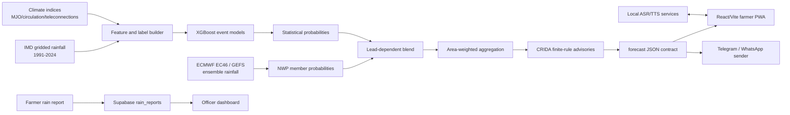
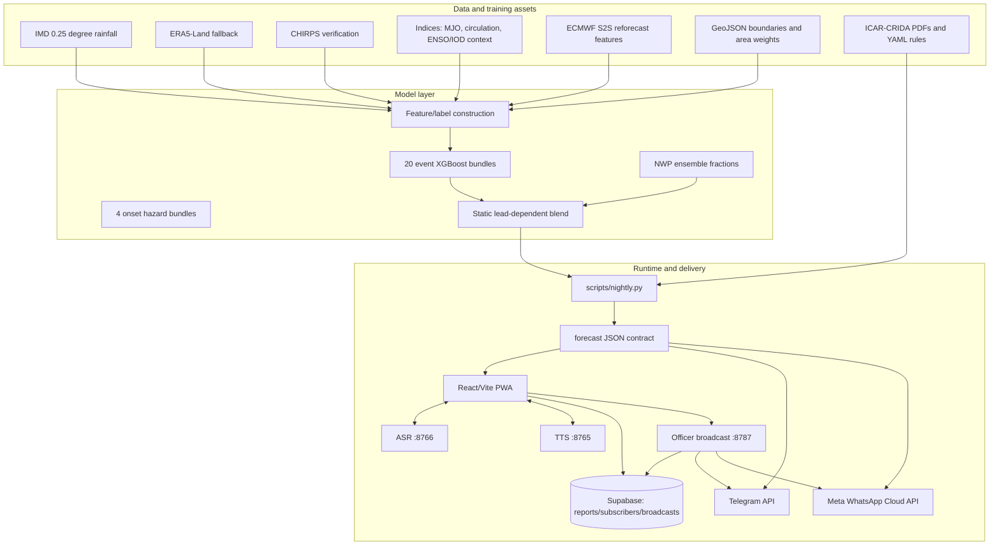

# VarshaDrishti

VarshaDrishti is an SIH monsoon decision-support prototype for Karnataka farmers. It converts gridded historical rainfall, current observations, extended-range ensemble forecasts, circulation/MJO predictors, and ICAR-CRIDA agronomic rules into localized probabilities and plain-language actions.

The repository implements an offline-first demonstration: a nightly forecast job writes a versioned JSON contract, a React/Vite PWA reads that contract at hobli/block/district level, and optional local ASR/TTS and officer notification services add voice and messaging workflows.

> **Implementation status.** This README describes the code actually present in this repository. Where a capability is only scaffolded, optional, stale, or absent, it is called out explicitly. The repository is a Karnataka pilot; a nationwide production rollout, authenticated farmer identity system, and hosted backend are **not implemented** here.

## SIH problem and proposed solution

Farmers need an answer to practical questions such as “should I sow now?” rather than a raw rainfall map. The SIH problem addressed here is extended-range monsoon decision support at local administrative scales, including onset uncertainty, false onset, dry spells, and heavy-rain risk.

The solution is to:

1. Build cell-day training examples from IMD rainfall for Karnataka.
2. Train probabilistic XGBoost event models for 7, 14, 21, and 28-day horizons.
3. Add ECMWF S2S rainfall where validated, plus circulation and MJO predictors.
4. Blend statistical probabilities with EC46/GEFS ensemble-member probabilities.
5. Aggregate grid cells to hoblis, blocks, and districts using stored area weights.
6. Apply finite, auditable CRIDA rule packs to produce localized actions.
7. Deliver the result as a small JSON contract for an offline-capable farmer PWA, with optional Kannada/Hindi/Telugu/English voice and Telegram/WhatsApp paths.

## Key features

- Farmer onboarding by language, hobli, crop, and optional phone number.
- Today, rain report, “why”, replay/hindcast, verification, and officer routes.
- Probability cards for onset, false onset, 7-day dry spell, 14-day dry spell, and heavy rain.
- Week-by-week lead cards (`w1`–`w4`) backed by generated forecast data.
- Area-weighted aggregation from IMD cells to panchayat/hobli, block, and district.
- Offline forecast caching through the Vite PWA service worker.
- Offline rain-report outbox with later Supabase flush.
- CRIDA source-document/table references in advisories.
- Local IndicConformer ASR for Kannada, Hindi, and Telugu.
- Local Indic Parler-TTS for Kannada, Hindi, Telugu, and English.
- Optional Telegram and WhatsApp sends from forecast JSON.
- Officer dashboard with rainfall reports, subscriber counts, preview, and reviewable broadcast action.
- Replay/hindcast artifacts for explaining model behavior.

## End-to-end workflow



### Forecast generation

`scripts/nightly.py` is the operational assembly point. It loads area-weight matrices, obtains recent observations from the Open-Meteo forecast API or cache, derives live features, loads the frozen inference table, runs XGBoost, optionally loads EC46 and GEFS caches, blends the probabilities, aggregates them to named areas, evaluates CRIDA rules, and emits the contract files.

The nightly GitHub Actions job runs at `20:00 UTC` (`01:30 IST`), fetches indices and NWP data, runs the pipeline, validates the P6 contract, and commits changed forecast/cache files. It is configured in `.github/workflows/nightly.yml`.

## System architecture



## Machine-learning report

### Data sources and inputs

| Input | Repository implementation | Role |
|---|---|---|
| IMD gridded rainfall | `src/varshadrishti/data/rainfall.py`, `scripts/download_imd.py` | Primary historical truth; 0.25° grid, 1991–2024, Karnataka cells |
| ERA5-Land | rainfall loader fallback | Fallback data path; not the primary trained truth |
| CHIRPS | `scripts/download_chirps.py` | 0.05° rainfall for panchayat-scale verification/analysis |
| ECMWF EC46 | `scripts/fetch_nwp.py`, `data/cache/ec46` | 46-day ensemble rainfall at inference time |
| NOAA GEFS | `scripts/fetch_nwp.py`, `data/cache/gefs` | 35-day ensemble rainfall and proxy used for blend evidence/weights |
| Open-Meteo observations | `src/varshadrishti/pipeline/observations.py` | Recent rainfall for live features; cached for replay |
| MJO/RMM and circulation indices | `data/raw/indices*`, `src/varshadrishti/features/indices.py`, `extended.py` | Intraseasonal/large-scale predictors |
| ENSO/IOD/teleconnection indices | `oni`, `dmi`, `nino34_anom` and provenance output | Ingested and reported as context; excluded from shipped statistical features after documented ablations |
| CRIDA documents | `data/crida/*.pdf`, `src/varshadrishti/rules` | Source material and rule-backed crop actions |

The nested `varsha-drishti-model/` package contains the training-side implementation and raw model-development assets. The root application keeps the serving contract and trained bundles under `models/xgb/`.

### Labels and targets

The definitions are in `src/varshadrishti/features/labels.py`:

- rainy day: at least 2.5 mm;
- onset: a 5-day wet window with at least 3 rainy days, subject to the 20–40 mm onset threshold and season bounds;
- false onset: an onset-like spell followed by a 10-day dry break, checked within the documented 30-day window;
- 7-day dry spell and 14-day dry spell/break;
- heavy rain: at least 64.5 mm;
- season: June 1 through September 30, with onset confirmation and cutoff rules encoded in the label module.

The contract trains five event families at four cumulative horizons: `onset`, `false_onset`, `dry7`, `dry14`, and `heavy` × 7/14/21/28 days = 20 binary classifiers. Four additional discrete-time onset hazard models estimate onset in weeks 1–4 and are chained into a survival curve.

### Preprocessing and feature engineering

The feature builder uses causal rainfall history and seasonal context. The documented windows are 1, 3, 7, 14, and 30 days, with wet-day counts, days since rain, wet-spell state, days since a wet spell, spell deficit, regional rain/dry context, and cell-versus-region rainfall. It adds seasonal day-of-year, cell climatology, onset anomaly, RMM/MJO variables, and (for the extended training path) circulation anomalies/trends and valid-time MJO phase features.

ECMWF features are ensemble mean and spread for 7, 14, 21, and 28 days. They are sparse because they come from real ECMWF cycle/hindcast dates; missing values are supported by XGBoost’s native missing-value path. At live inference, `feature_coverage` records known gaps, including the documented ECMWF reforecast coverage ending in 2023 and circulation-index coverage ending in 2024.

The model code excludes identifiers and `oni`, `dmi`, and `nino34_anom` from predictor columns. Repository comments record why: paired tests and ENSO-conditioned/shuffled comparisons did not demonstrate robust generalization with only 34 independent seasons. These signals remain in provenance/context rather than being silently claimed as predictive features.

### Training, validation, and test strategy

The split is chronological by monsoon year, so an entire season stays in one partition:

| Split | Years |
|---|---:|
| Train | 1991–2015 |
| Validation | 2016–2019 |
| Test | 2020–2024 |

The nested training package implements the split, model fitting, validation threshold selection, and bundle persistence. The shipped metadata reports row counts per model; the documented panel is 323 cells × 34 seasons × seasonal days, approximately 1.34 million cell-day rows before target-specific missing-label filtering.

### Models and configuration

- Event models: XGBoost `XGBClassifier`, `binary:logistic`, log-loss evaluation, histogram tree method, deterministic `random_state=42`, early stopping, and no class reweighting by default so probability quality is not distorted.
- The base configuration is in `varsha-drishti-model/src/varshadrishti/config.py`. Shipped bundles contain per-target tuned hyperparameters in `metadata.json`; exact learning rate/tree count can therefore differ by target.
- Decision thresholds are selected on validation to maximize F1. Probabilities are emitted as raw binary-logistic probabilities; forecast provenance says there is no isotonic/out-of-fold calibration map.
- NWP event probabilities are member fractions with Laplace adjustment. `src/varshadrishti/pipeline/blend.py` applies current lead weights `w1=0.32`, `w2=0.09`, `w3=0.01`, `w4=0.06`, plus the implemented sharpening/recalibration transform.

### Held-out results in the shipped event bundles

The following are ROC-AUC and Brier Skill Score from `models/xgb/events/**/metrics.json` for test years 2020–2024. BSS is relative to the train-period climatology reference; values above zero beat that reference.

| Event | 7 days | 14 days | 21 days | 28 days |
|---|---:|---:|---:|---:|
| Onset ROC-AUC / BSS | 0.872 / 0.441 | 0.826 / 0.294 | 0.788 / 0.183 | 0.758 / 0.113 |
| False onset ROC-AUC / BSS | 0.746 / 0.140 | 0.690 / 0.096 | 0.677 / 0.099 | 0.691 / 0.119 |
| 7-day dry ROC-AUC / BSS | 0.739 / 0.148 | 0.746 / 0.175 | 0.752 / 0.198 | 0.765 / 0.234 |
| 14-day dry ROC-AUC / BSS | 0.757 / 0.079 | 0.693 / 0.030 | 0.666 / 0.031 | 0.683 / 0.072 |
| Heavy rain ROC-AUC / BSS | 0.879 / 0.349 | 0.845 / 0.347 | 0.819 / 0.344 | 0.791 / 0.322 |

The onset hazard documentation reports approximately 0.78 AUC for week 1 and approximately 0.55 for week 4. Week 4 should be treated as low confidence.

### Experiments, ablations, and selection rationale

- ECMWF S2S features were retained for cumulative onset models and onset-hazard weeks 1–3 after documented ablation showed positive BSS deltas; they were not retained for false onset, dry7, dry14, heavy, or hazard week 4.
- ENSO/IOD fields were tested as direct predictors and conditioned climatology. The repository records negative or statistically inconclusive results, so they are context/provenance rather than model features.
- The 14-day dry/break target remains weak after multiple attempted fixes; it is shipped because it is operationally relevant, not because it is strong.
- NWP blend evidence was derived from GEFS reforecast/proxy experiments. The code distinguishes that evidence from the EC46 runtime source; current weights are not a fresh EC46-only calibration.
- XGBoost plus a conservative NWP blend was selected because it is lightweight at inference, versioned, auditable, and has positive held-out BSS for the principal event families. No claim is made that all event families are equally reliable.

Strengths are chronological held-out testing, probability-oriented Brier/BSS reporting, explicit provenance, native missing-feature handling, auditable rules instead of an opaque generative recommendation layer, and offline reproducibility through cached inputs and JSON artifacts.

Limitations include only 34 independent monsoon seasons, Karnataka-focused training, weak 14-day dry-spell performance, declining onset-hazard skill at long lead, sparse ECMWF hindcast coverage, uncalibrated raw XGBoost probabilities, static blend weights, approximate crop-stage logic, and no causal guarantee that a recommendation improves yield.

## How weather becomes a farmer recommendation

1. `scripts/fetch_nwp.py` caches EC46 and/or GEFS precipitation ensembles for IMD cells covering the pilot. `pipeline/nwp.py` converts member trajectories to event probabilities.
2. `pipeline/observations.py` obtains recent rainfall from cache/Open-Meteo or IMD replay. `pipeline/infer.py` constructs current causal features and runs the 20 XGBoost bundles. Cumulative probabilities are converted to weekly lead risks where required by the runtime contract.
3. `pipeline/blend.py` combines statistical and NWP probabilities with lead-specific weights and records source diagnostics.
4. `pipeline/aggregate.py` applies stored IMD-to-area weight matrices to produce panchayat/hobli, block, and district values.
5. `rules/engine.py` loads YAML CRIDA packs, derives a coarse crop stage from onset delay, selects up to three actions, and writes English/Kannada text plus document/table references.
6. `contract.py` validates and writes `forecast/latest.json`, `forecast/index.json`, and per-area files. The browser reads these stable files; it does not run XGBoost.

## Backend, frontend, database, and notifications

### Frontend

`web/` is a React 18 + Vite 5 PWA using React Router, MapLibre, and optional Supabase JS. `web/vite.config.js` serves root `forecast/` and `geo/` during development and copies them into `web/dist` during a build. `scripts/prebuild.mjs` runs `scripts/split_forecast.py` first.

Routes are `/`, `/today`, `/rain`, `/why`, `/officer`, `/replay`, and `/verify`. Farmer preferences are local. Forecast and geo assets use service-worker caching. Browser ASR/TTS helpers use `VITE_ASR_SERVER_URL` and `VITE_TTS_SERVER_URL`, falling back to `http://localhost:8766` and `http://localhost:8765`.

### Speech services

ASR (`services/asr/server.py`): `GET /health`, `POST /transcribe` with multipart field `audio` and `X-Lang: kn|hi|te`, and `POST /interpret` for repository keyword intent matching. ffmpeg converts audio to 16 kHz mono WAV. English is supported by interpretation vocabulary, not by the IndicConformer language mask.

TTS (`services/tts/server.py`): `GET /health` and `POST /synthesize` with `{ "text": "...", "lang": "kn|hi|te|en" }`, returning WAV. Indic Parler-TTS loads once at startup and uses separate spoken-text and voice-description tokenizers. First startup is slow because weights load; later requests reuse the process. These are local development services, not hosted speech infrastructure.

### Database

`schema/supabase.sql` creates:

- `rain_reports`: anonymous area-level `none|light|heavy` reports, with RLS allowing anonymous insert/select;
- `subscribers`: area, channel, destination, language, crop, and active state. Anonymous insert is allowed only for WhatsApp/SMS onboarding rows; service-role code reads the list;
- `broadcasts`: service-role audit log of area IDs, event, lead, channel, count, dry-run, and trigger source.

The frontend queues rain reports offline and flushes them online. It can register WhatsApp/SMS destinations. `src/varshadrishti/data/supabase_client.py` reads subscribers and logs sends. Unconfigured Supabase degrades these paths to no-op/status responses so the forecast demo still runs.

### Telegram and WhatsApp

`services/telegram/send.py` sends the shared Kannada advisory to a CLI override, Supabase subscribers, `TELEGRAM_CHAT_ID`, or local `subscribers.json`. `services/whatsapp/send.py` calls the Meta Graph API and supports free text within the WhatsApp session window or a pre-approved template.

`services/broadcast_server.py` is a local officer boundary on port 8787. It previews and sends reviewed broadcasts using the Supabase subscriber list, then best-effort logs successful sends. SMS is **not implemented as a sender** in the current tree even though `sms` is present in the schema and onboarding registration code; there is no supported `services/sms/send.py`.

## API reference

### Static forecast contract

```http
GET /forecast/index.json
GET /forecast/area/KGIS-H-180901.json
```

An area response contains `meta`, `forecast`, `skill`, and `provenance_summary`. `forecast` includes area identity, `p_onset`, `p_false_onset`, `p_dry7`, `p_dry14`, and `p_heavy` as `w1`–`w4` maps, onset status/delay, confidence, advisories, and English/Kannada text. Exact schemas are `schema/area.schema.json` and `schema/forecast.schema.json`.

### ASR

```bash
curl http://localhost:8766/health
curl -X POST http://localhost:8766/transcribe -H 'X-Lang: hi' -F 'audio=@sample.webm'
```

Response shape: `{ "transcript": "...", "lang": "hi", "action": "unknown|rain_yes|rain_no|advisory|repeat", "reply_text": "..." }`.

### TTS

```bash
curl http://localhost:8765/health
curl -X POST http://localhost:8765/synthesize \
  -H 'Content-Type: application/json' \
  -d '{"text":"ಇಂದು ಬಿತ್ತನೆ ಮಾಡಬೇಡಿ","lang":"kn"}' --output advisory.wav
```

### Officer broadcast service

```http
GET  http://localhost:8787/api/health
GET  http://localhost:8787/api/subscriber-counts
GET  http://localhost:8787/api/preview?areaId=KGIS-H-180901
POST http://localhost:8787/api/broadcast
```

Protected POST body:

```json
{
  "token": "the value configured in OFFICER_BROADCAST_TOKEN",
  "areaIds": ["KGIS-H-180901"],
  "event": "p_dry7",
  "lead": "w1",
  "channels": ["telegram", "whatsapp"]
}
```

The response contains `sent`, `failed`, and per-area/channel results. The service is explicitly documented in code as local/non-production.

## Repository structure

```text
.
├── data/                         Raw caches and processed parquet tables
│   ├── cache/{ec46,gefs,obs}/    NWP and observation caches
│   ├── crida/                    Source advisory PDFs
│   └── processed/                Features, inference tables, area weights
├── docs/                         Project documentation and decisions
├── forecast/                     Generated JSON contract, archives, hindcast
├── geo/                          Karnataka boundaries and names as GeoJSON
├── models/xgb/                   Event/hazard bundles and metrics
├── schema/                       JSON schemas and Supabase SQL schema
├── scripts/                      Download, build, inference, training support, QA
├── services/                     ASR, TTS, Telegram, WhatsApp, broadcast server
├── src/varshadrishti/            Runtime data, features, inference, blending, rules
├── tests/                        Data, contract, geo, pipeline, replay, officer tests
├── varsha-drishti-model/         Separate training package and model-development data
└── web/                          React/Vite PWA
```

Important files include `scripts/nightly.py`, `scripts/build_features.py`, `scripts/fetch_nwp.py`, `scripts/split_forecast.py`, `src/varshadrishti/contract.py`, `src/varshadrishti/pipeline/{infer,nwp,blend,aggregate}.py`, `src/varshadrishti/rules/engine.py`, `models/xgb/README.md`, `schema/supabase.sql`, `web/src/App.jsx`, `web/src/lib/api.js`, and `web/vite.config.js`.

## Prerequisites and local setup

Commands below assume macOS/Linux and a checkout. Windows helper commands exist in `build_all.ps1` and `download_rest.ps1`.

### Python and frontend

```bash
cd /path/to/SIH
python3.12 -m venv .venv
source .venv/bin/activate
python -m pip install --upgrade pip
python -m pip install -r requirements.txt
python -m pip install -r services/asr/requirements.txt
python -m pip install -r services/tts/requirements.txt
cd web
npm install
npm run dev
```

Install `ffmpeg` separately and ensure it is on `PATH` for ASR conversion. Open `http://localhost:5173`. The first TTS/ASR model download/load is optional and slow; browser fallbacks exist.

### Forecast and model commands

```bash
cd /path/to/SIH
source .venv/bin/activate
python scripts/split_forecast.py
python scripts/nightly.py --as-of 2024-09-30 --offline
python scripts/split_forecast.py
```

Live fetch/inference:

```bash
python scripts/fetch_nwp.py --model ec46 --date YYYY-MM-DD
python scripts/fetch_nwp.py --model gefs --date YYYY-MM-DD
python scripts/nightly.py --as-of YYYY-MM-DD
```

Historical rebuild:

```bash
python scripts/download_imd.py
python scripts/build_geo.py
python scripts/build_features.py --start 1991 --end 2024
python scripts/export_inference_tables.py
```

The nested training package is installable and runnable separately:

```bash
cd varsha-drishti-model
python -m pip install -e .
python -m varshadrishti.model.train
```

Use `--groups onset heavy`, `--extended`, or `--no-tuned` as documented by the training script. This command writes bundles under `varsha-drishti-model/models/`; the repository has no verified export/copy command that automatically promotes newly trained bundles into the root `models/xgb/` serving directory. Training requires the model-ready parquet/index inputs and is not required to serve the committed root bundles.

### Speech, database, notifications, tests

```bash
cd /path/to/SIH
source .venv/bin/activate
python scripts/asr_setup.py
python scripts/tts_setup.py
python services/asr/server.py          # terminal 1, :8766
python services/tts/server.py          # terminal 2, :8765
python services/broadcast_server.py    # optional terminal 3, :8787
pytest -q
```

For Supabase: create a project, run `schema/supabase.sql` in its SQL editor, then configure `.env`. For notifications, use the dry-run commands before sending:

```bash
python services/telegram/send.py --area KGIS-H-180901 --dry-run
python services/whatsapp/send.py --area KGIS-H-180901 --dry-run
```

The test suite covers data fallbacks, contract validation, geography, features, pipeline/replay, XGBoost integration, Supabase, officer behavior, and broadcast paths. External APIs, model downloads, credentials, and the absent SMS sender make a full run environment-dependent.

## Environment variables

Never commit `.env`. Use `.env.example` as the starting point.

| Variable | Required for | Where it comes from / actual use |
|---|---|---|
| `SUPABASE_URL` | Python Supabase services | Supabase project API settings; used with service key server-side |
| `SUPABASE_ANON_KEY` | Optional Python/browser compatibility | Supabase project API settings; browser specifically uses the Vite-prefixed name |
| `SUPABASE_SERVICE_KEY` | Subscriber reads and broadcast audit logging | Supabase service-role key; server-only |
| `VITE_SUPABASE_URL` | Browser reports/registration | Same Supabase project URL |
| `VITE_SUPABASE_ANON_KEY` | Browser Supabase client | Supabase anon/public key; RLS remains the security boundary |
| `TELEGRAM_BOT_TOKEN` | Telegram CLI/broadcast | BotFather-created token; keep secret |
| `TELEGRAM_CHAT_ID` | Single-chat Telegram fallback | Telegram chat ID; optional with Supabase/CLI override |
| `WHATSAPP_PHONE_NUMBER_ID` | WhatsApp sender | Meta WhatsApp Cloud API phone-number ID |
| `WHATSAPP_ACCESS_TOKEN` | WhatsApp sender | Meta Graph API access token; keep secret |
| `WHATSAPP_TEST_RECIPIENT` | WhatsApp fallback recipient | Recipient number expected by the sender |
| `WHATSAPP_VERIFY_TOKEN` | Nothing currently | Example-only future webhook value; no current code reads it |
| `TTS_SERVER_URL` | Python-side documentation value | Example is `http://localhost:8765`; browser uses the Vite-prefixed variable below |
| `ASR_SERVER_URL` | Python-side documentation value | Example is `http://localhost:8766`; browser uses the Vite-prefixed variable below |
| `VITE_TTS_SERVER_URL` | Browser TTS service URL | Vite-exposed URL used by the frontend speech client |
| `VITE_ASR_SERVER_URL` | Browser ASR service URL | Vite-exposed URL used by the frontend voice assistant |
| `OFFICER_BROADCAST_TOKEN` | Protected broadcast POST | Operator-created shared passcode for the local service |
| `PILOT_STATE` | Optional pipeline context | Defaults to Karnataka; no general multi-state production switch |

## SIH demo workflow

1. Start the PWA and open onboarding.
2. Select Kannada, Hindi, Telugu, or English; choose a Karnataka hobli and crop.
3. Open Today and demonstrate current and future lead cards, English/Kannada recommendation text, confidence, and source references.
4. Use Rain Report offline, submit none/light/heavy, reconnect, and show the queued report reaching Supabase/officer view.
5. Open Why to explain weather inputs and CRIDA reasoning.
6. Start ASR/TTS and demonstrate localized speech or rain/advisory intent interpretation.
7. Open Replay to show hindcast artifacts.
8. As an officer, inspect reports/subscriber counts, preview the advisory, enter the broadcast token, and send a reviewed Telegram/WhatsApp message.
9. For a technical judge, show an area JSON file, model metrics, provenance, and CRIDA source table reference.

## Deployment and production support

Implemented deployment support consists of a static Vite build (`npm run build`), a PWA service worker for shell/forecast/geo/photo/font caching, and the GitHub Actions nightly workflow that regenerates and commits forecast artifacts. Speech and officer broadcast are local Python services.

There is no Dockerfile, Kubernetes manifest, Terraform configuration, hosted API gateway, production authentication system, or verified Vercel project configuration in the current tree. Comments mention a future Vercel broadcast function, but it is **not implemented**. The local services bind to localhost and are not suitable as public production services without a separate secure deployment design.

## XGBoost model report

This section documents the actual XGBoost implementation and the metrics bundled with this repository. It is intended to make the model understandable and reproducible for SIH evaluation.

### Model purpose

The model estimates the probability that a weather event will occur within a future horizon for each IMD rainfall cell covering the Karnataka pilot. It does not directly predict a crop yield or issue an official warning. Its output is one input to the NWP blend and the CRIDA recommendation engine.

The event families are:

| Group | Target |
|---|---|
| `onset` | Monsoon onset within 7, 14, 21, or 28 days |
| `false_onset` | A false onset pattern within the corresponding horizon |
| `dry7` | A seven-day dry spell within the horizon |
| `dry14` | A fourteen-day dry spell/break within the horizon |
| `heavy` | Heavy rainfall, using the 64.5 mm label threshold, within the horizon |

There are 20 independent binary classifiers: five groups × four horizons. The repository also contains four discrete-time onset hazard models, one for each forecast week, which are chained into an onset survival curve.

### Training data panel

- Region: Karnataka IMD cells referenced by the area-weight matrices.
- Spatial resolution: IMD 0.25° rainfall grid.
- Historical period: 1991–2024, June–September monsoon season.
- Spatial coverage used by the bundled model: 323 cells.
- Independent seasons: 34.
- Training implementation: `varsha-drishti-model/src/varshadrishti/model/`.
- Serving implementation: `src/varshadrishti/model/predict_xgb.py`.
- Persisted serving artifacts: `models/xgb/events/` and `models/xgb/onset_hazard/`.

The training table is generated by `scripts/build_features.py` and stored as `data/processed/features.parquet` in the model-development package. It combines cell-day rainfall history with labels, seasonal position, climatology, regional context, MJO/RMM fields, circulation predictors, and optional ECMWF S2S predictors.

### Target construction

Target construction is implemented in `src/varshadrishti/features/labels.py`. Important thresholds are explicit in code rather than hidden in a model:

- rainy day: `2.5 mm`;
- onset wet-window requirement: five days containing at least three rainy days;
- onset threshold range: `20–40 mm`;
- false-onset dry-break check: 10 days with the documented 30-day confirmation window;
- heavy rainfall: `64.5 mm`;
- season: June 1 through September 30.

For each event and horizon, the label is binary. Rows with unavailable target labels are excluded from that target’s training matrix by the training loader.

### Predictor groups

The base feature contract is defined in `varsha-drishti-model/src/varshadrishti/config.py` and enforced by `src/varshadrishti/model/train.py`:

1. **Rainfall history:** `rain_1d`, `rain_3d`, `rain_7d`, `rain_14d`, `rain_30d`.
2. **Wet/dry state:** wet-day counts, days since rain, wet-spell state, days since wet spell, and spell deficit.
3. **Regional context:** regional seven-day rainfall, regional dry state, and cell rainfall relative to the region.
4. **Seasonal/climatological context:** day-of-year, climatological rainfall/dry/onset dates, false-onset rate, and onset day anomaly.
5. **MJO/RMM:** `rmm1`, `rmm2`, MJO amplitude and phase.
6. **Circulation extension:** low-level jet, shear, Bay of Bengal wind, trough pressure, temperature gradient, OLR, MJO cyclic features, and short trends when the extended feature set is requested.
7. **ECMWF S2S:** ensemble mean and standard deviation for 7, 14, 21, and 28-day rainfall windows where the validated ECMWF feature path is enabled.

The model deliberately excludes identifiers (`date`, `cell_id`, `year`, `sday`) and the direct ENSO/IOD columns `oni`, `dmi`, and `nino34_anom` from the predictor matrix. Those variables are still ingested and published as teleconnection context. The repository records paired ablations and ENSO-conditioned comparisons that did not provide reliable unseen-year skill with the available 34 seasons.

### ECMWF feature decision

The ECMWF features are not added indiscriminately. The training configuration records the validated scope:

- all four cumulative onset models use ECMWF S2S features;
- onset hazard weeks 1–3 use ECMWF S2S features;
- hazard week 4 does not use them after a negative ablation;
- false onset, dry7, dry14, and heavy-rain models do not use them because the ablation did not show reliable improvement.

The ECMWF reforecast join is sparse by design because it only uses real cycle dates and its documented historical coverage. Missing ECMWF columns are passed as missing values; XGBoost handles them through its learned default directions instead of replacing them with fabricated rainfall.

### Chronological evaluation design

The model never randomly mixes years across train and test. The complete monsoon season for each year is kept together:

| Partition | Years | Purpose |
|---|---:|---|
| Train | 1991–2015 | Fit trees and estimate the climatology reference rate |
| Validation | 2016–2019 | Early stopping, tuned parameter selection, and F1 threshold selection |
| Test | 2020–2024 | Final held-out evaluation, untouched during model development |

The validation threshold is selected from validation predictions rather than assuming `0.5`, which is important for imbalanced event labels. The probability itself is not changed by this threshold. The test metrics in the next table are therefore probability/ranking results from unseen years, while precision/recall/F1 in each bundle are threshold-dependent hard-classification results.

### XGBoost configuration

The baseline configuration in `varsha-drishti-model/src/varshadrishti/config.py` is:

```text
objective              = binary:logistic
eval_metric            = logloss
tree_method            = hist
n_estimators           = 1200 baseline / 1500 tuned search budget
max_depth              = 5 baseline
learning_rate          = 0.05 baseline
subsample              = 0.8 baseline
colsample_bytree       = 0.8 baseline
min_child_weight       = 5 baseline
reg_lambda             = 1.0 baseline
early_stopping_rounds  = 75 baseline
random_state           = 42
n_jobs                 = -1
scale_pos_weight       = 1.0 by default
```

The persisted bundles contain the final per-target values in `metadata.json`; tuned models can therefore differ from the baseline. Class reweighting is disabled by default because the repository measured that it damaged Brier skill even when it changed ranking only slightly. The selected operating threshold is stored with every model bundle.

### Metrics and results

The following values are read from the shipped `models/xgb/events/**/metrics.json` files for test years 2020–2024. Each cell is `ROC-AUC / Brier Skill Score`, with BSS measured against the train-period climatology reference.

| Event family | 7 days | 14 days | 21 days | 28 days |
|---|---:|---:|---:|---:|
| Onset | 0.872 / 0.441 | 0.826 / 0.294 | 0.788 / 0.183 | 0.758 / 0.113 |
| False onset | 0.746 / 0.140 | 0.690 / 0.096 | 0.677 / 0.099 | 0.691 / 0.119 |
| 7-day dry spell | 0.739 / 0.148 | 0.746 / 0.175 | 0.752 / 0.198 | 0.765 / 0.234 |
| 14-day dry spell | 0.757 / 0.079 | 0.693 / 0.030 | 0.666 / 0.031 | 0.683 / 0.072 |
| Heavy rain | 0.879 / 0.349 | 0.845 / 0.347 | 0.819 / 0.344 | 0.791 / 0.322 |

Interpretation of the bundled results:

- Onset and heavy-rain models show the strongest held-out ranking and probability skill.
- False-onset performance is useful but weaker than the principal onset/heavy groups.
- The 14-day dry-spell group is materially weaker, especially at 14–21 days, and should be treated as a low-confidence signal.
- Skill generally declines with lead for onset and heavy rain.
- The separate onset hazard curve is strongest in week 1, reported around 0.78 AUC, and approaches random behavior by week 4, reported around 0.55 AUC.
- ROC-AUC describes ranking quality; BSS describes probabilistic improvement over climatology. Neither metric is a direct measure of yield impact.

### Inference and probability handling

At runtime, `predict_xgb.py` loads each model’s ordered `features.json`, fills the feature row from live observations/climatology/NWP-derived fields, and returns the model’s binary-logistic probability. Missing feature values are allowed by XGBoost’s native missing-value behavior.

The nightly pipeline then:

1. converts cumulative horizon outputs into the weekly lead representation used by the contract;
2. computes NWP member-fraction probabilities with the Laplace adjustment in `pipeline/nwp.py`;
3. blends statistical and NWP probabilities with current weights `w1=0.32`, `w2=0.09`, `w3=0.01`, and `w4=0.06`;
4. applies the implemented sharpening/recalibration transform;
5. aggregates cell probabilities by area weights; and
6. passes the resulting event probabilities to the CRIDA rule engine.

The current XGBoost probabilities are not passed through an isotonic or out-of-fold calibration map. The linear blend is also not fully recalibrated. The provenance block in every generated forecast records the model source, split, excluded features, NWP sources, weights, and calibration statement so a judge can inspect how the final number was produced.

### Experiments and final model choice

The repository includes `scripts/derive_blend_weights.py`, `scripts/exp_longlead.py`, `scripts/validate_w1_recalibration.py`, `scripts/verify_nwp.py`, and `scripts/verify_nwp_shortlead.py` for model/NWP comparisons. The documented findings are:

- ECMWF improves cumulative onset and hazard weeks 1–3, but not the other event groups or hazard week 4.
- Direct ENSO/IOD conditioning did not produce robust unseen-year gains, so those signals remain context.
- Extending the dry/break target did not remove its weak 14-day ceiling.
- Statistical probabilities outperform the NWP proxy at most leads; NWP is retained where it adds useful short-lead diversity.
- A lightweight XGBoost bundle was selected over a heavier runtime because it loads from JSON, exposes exact feature lists/importances/metrics, handles missing sparse S2S inputs, and can run inside the nightly/static-JSON architecture.

This design makes the model suitable for the SIH prototype workflow: the judge can reproduce feature construction, inspect a model bundle, compare the held-out metrics, follow the probability through blending and aggregation, and see the exact rule/source text shown to a farmer.

## SIH project attribution

VarshaDrishti was created as a Smart India Hackathon (SIH) project and prepared for SIH demonstration and evaluation. The repository combines original project code with third-party libraries, public/partner data sources, pretrained model checkpoints, Open-Meteo/Meta/Telegram integrations, and ICAR-CRIDA reference documents. Their respective terms and attribution requirements continue to apply.

No formal repository-wide open-source license file is currently included. If this project is distributed outside the SIH submission, add the intended license and verify the redistribution terms for all datasets, checkpoints, APIs, and source documents first.
